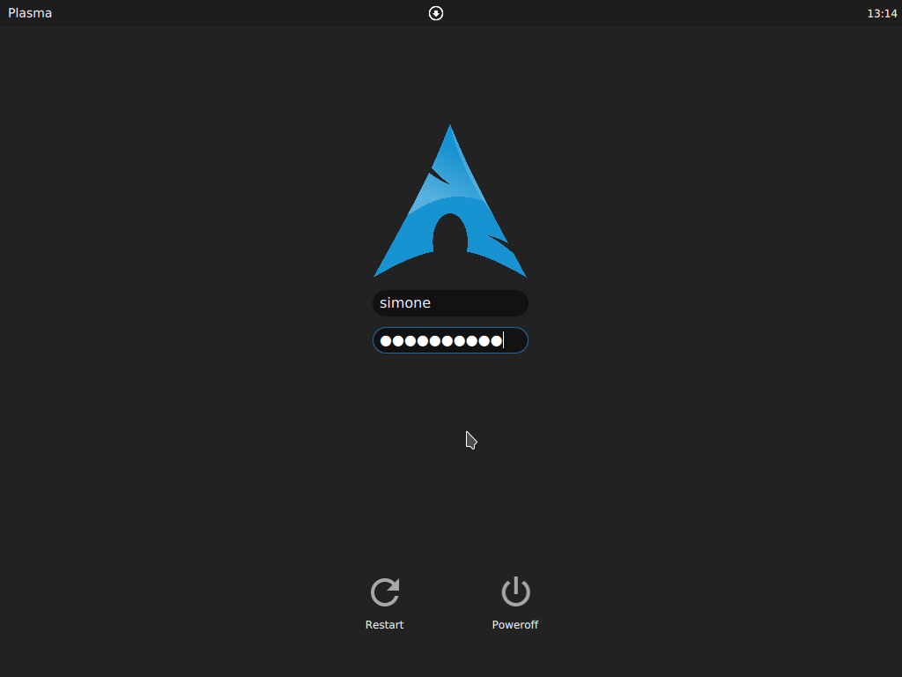

# Simple Dark Theme

A simple dark theme for sddm

# Installation

    git clone https://github.com/simonesestito/dark-arch-sddm
    cd dark-arch-sddm
    ./install.sh #Requires sudo authentication

Then, apply the theme in KDE Settings
(Settings > Workspace > Startup and shutdown > Login Screen (SDDM) > click on Simple Dark Theme, apply, authenticate and reboot)

# Customize the logo

Did you know? In install.sh you can easily select the logo you prefer.
It isn't in the list? Open an issue here on GitHub specifying the distro name and a url to the logo you want.

    
# Screenshot
    

