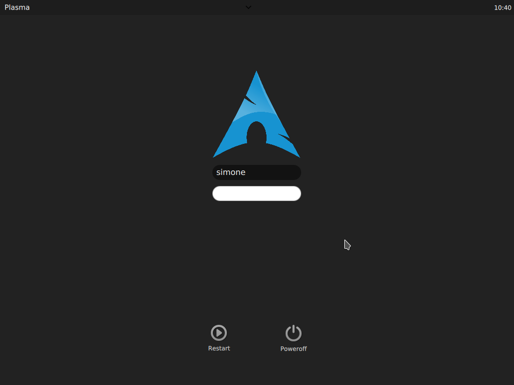

# Simple Dark Theme

A simple dark theme for sddm

# Installation

    git clone https://github.com/simonesestito/dark-arch-sddm
    cd dark-arch-sddm
    ./install.sh #Requires sudo authentication

Then, apply the theme in KDE Settings
(Settings > Workspace > Startup and shutdown > Login Screen (SDDM) > click on Simple Dark Theme, apply, authenticate and reboot)

# FAQ

*Q: I don't like it because I'm not on Arch*

A: you can customize the logo. In the install.sh you can select your favourite logo.

*Q: My distro logo isn't in the install script*

A: open a new issue and specify the distro name. If you're a good person, please attach a 512 x 512 logo in .png
    
# Screenshot
    

